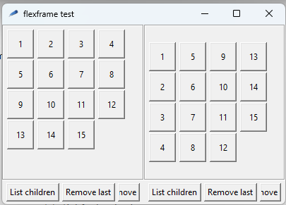
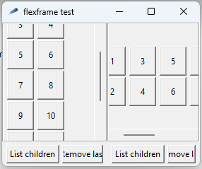
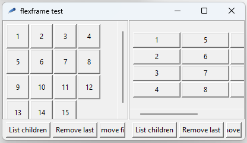

# flexframe

A Tcl/Tk megawidget which implements a scrollable frame with a responsive, grid-like, unidirectional layout for its children.

As children are added, it _grows_ in one direction, horizontal or vertical, while the other direction remains in a fixed size enough to show as many children as possible. 

When the flexframe is resized (along its window, for example), its children are automatically rearranged so the most of them remain visible in the current viewport.

In a vertical-growth flexframe, children are laid out side by side as long as they fit within the frame's width. Following children are shown in as many rows as needed. In an horizontal flexframe, children are stacked as many as possible before flowing to a new column.

A scrollbar can be automatically shown, in the growth direction, when the number of children widgets is larger than the viewport can show. As the scrollbar itself takes up more of the available space, this may cause a further rearrangement of children. 

The order in which children are added is preserved. The flexframe "start", from which its children will be laid out, can be configured with Tk anchor values `nw` (default, top left), `sw` (bottom left), `ne` (top right) or `se` (bottom right). The block of children can be optionally centered in the flexframe.

Each child is given a "parcel" of space equal in height and width to the largest of its siblings. About how children occupy their parcels, Tk anchors can be set to determine how each children "sticks" to the sides of the given space. The flexframe allows the configuration of a "sticky" strategy to be applied to all its children ("news" by default).

For simplicity, however, individual configuration of "sticky" for each child is not currently supported.

## Usage

The _flexframe-0.1.tm_ file is a regular Tcl/Tk source file named to work as a _Tcl module_ (see https://www.tcl-lang.org/man/tcl9.0/TclCmd/tm.html).

* Copy the file to a directory of your application, like `/lib`;
* Make sure that this directory is "visible" to the modules system, by a command like `::tcl::tm::path add lib` somewhere in your code;
* use it with something like `package require flexframe 1.0`.

If you don't want to use it as a module, just copy the file to your application and `source` it.

With the script loaded to your application, you can create a new flexframe with a command like `flexframe .tkpath ?-option -value?` .

The code creates a _flexframe_ namespace under the namespace in which the load process is done (not necessarily the root namespace). If this is the case of your application, the widget creation command and instance references may vary.

## Widget specific options

#### -autoscroll _boolean_

When set to 1 (default), a scrollbar will be automatically added in the same direction set by `-orient` and the flexframe itself will not request extra space in this orientation when it has more children than could fit. When set to 0, the flexframe will try to enlarge itself in the orientation set by `-orient` in the amount needed by its children.

#### -center _boolean_

If set to 1 or _true_, the block of children widgets will be centered in the "stretchy" direction of the flexframe. Otherwise, it will be aligned to the corner defined by the `-start` option. Default value is 0.

#### -minpad _size_

Defines the minimal padding to be respected among the children and the borders of the flexframe. In the "stretchy" direction, the actual distance varies according to how many children can be shown in the current viewport, and _size_ represents the minimal distance added both before and after the children; in the "growth" direction _size_ remains fixed and is simply added to both sides of the children block, adding up to the scrollable portion. The value for _size_ can be set in any of the forms accepted by _Tk_GetPixel_: an integer number followed by nothing meaning pixels, followed by "c" meaning centimeters, followed by "p" for points, followed by "m" for millimeters. The default value is 0.

#### -minsize _size_

Defines the minimal width or height the flexframe will accept in its "stretch" dimension, which is the opposite direction of the one set by the `-orient` option. By default, it is the width or height of the largest of its children plus the padding configured by the -minpad option. The value for _size_ can be set in any of the forms accepted by _Tk_GetPixel_: an integer number followed by nothing meaning pixels, followed by "c" meaning centimeters, followed by "p" for points, followed by "m" for millimeters. Default value is 0.

#### -orient _orientation_

Defines the direction in which the flexframe will grow, or, in other words, to which its children will be placed when they won't fit in the opposite direction of the viewport. The value for _orientation_ can be any of "v", "vertical", "h" or "horizontal". Default is "vertical".

#### -start _anchor_

Defines the corner of the flexframe where the children layout will start from, and also where each child will be placed after the previous one. Possible values for _anchor_ are "nw", "ne", "sw" or "se". Default is "nw".

In a vertical flexframe, "nw" means that the first child will be placed in the top-left corner of the flexframe, and the second child will be placed to the left of the first one if there is horizontal space available or below it otherwise. The "se" value means that the first child will be placed in the bottom right corner and the following child will be placed to its right if there is space available, or above otherwise. The "ne" value says the first child will be placed in the top right corner and the following child will be placed to its left or below.

In an horizontal flexframe, "nw" means the first child will be placed at the top left, and the second will be placed below if there is enough space in the viewport (with respect to `-minpad`), or to the right otherwise. The "se" value means the first child will be placed at the bottom right corner and the second will be placed above if there is enough space or to the left otherwise. And so on.

#### -sticky _strategy_

Defines the default space occupation strategy for the flexframe children. The value for _strategy_ is any combination of the characters "n", "e", "w" and "s".

#### -spacing _size_

Defines the spacing between the children, in both directions, but _size_ is not added to `-minpad`. The value for _size_ can be set in any of the forms accepted by _Tk_GetPixel_: an integer number followed by nothing meaning pixels, followed by "c" meaning centimeters, followed by "p" for points, followed by "m" for millimeters. Default value is 0.

## Widget commands

#### _path_ add _childPath_ ?index? 

Adds a previously created widget _childPath_ to the flexframe _path_. If _index_ is present, _childPath_ is inserted in the position; _childPath_ is added as the last child if _index_ is omitted, if _index_ has the value "end" or if _index_ is greater than the index of the current last child.

####  _path_ cget _option_

Returns the current value of configuration option _option_. 

#### _path_ children

Returns a list containing the paths of every children added to the flexframe.

#### _path_ clear ?index?

Removes one or all the children of flexframe _path_. If _index_ is given, it is removed from the flexframe (but not destroyed) and the children indices greater than _index_ are updated.

#### _path_ configure ?-option1 value1? ?-option2 value2?...

Configures the flexframe _path_ with the passed options and their new values. If one or more option-value pairs are specified, then the command modifies the given widget option(s) to have the given value(s); in this case the command returns an empty string. If option is specified with no value, then the command returns a list describing the named option: the elements of the list are the option name, database name, database class, default value, and current value. If no option is specified, returns a list describing all of the available options for pathName.

#### _path_ remove _childpath_

Removes _childpath_ from the flexframe. The following children are automatically reordered. _childpath_ is not destroyed.

## Test application

The test application was used for generating the images you saw above. You can execute it with  with `tclsh t-flexframe.tcl` in this directory.